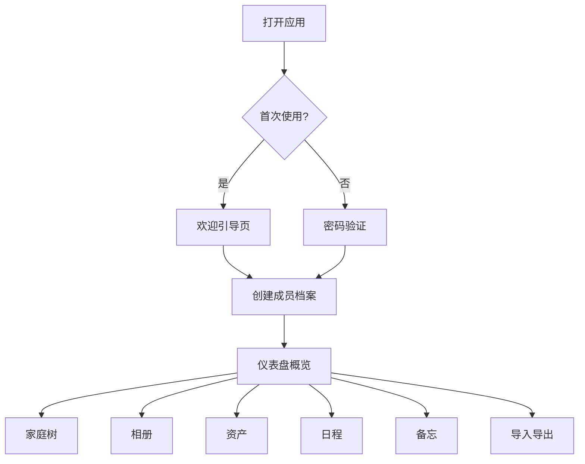

## 1. 产品概述

家庭私密空间是一款纯前端家庭信息管理工具，无需登录，所有数据本地存储，保护家庭隐私。它帮助家庭成员集中管理档案、相册、资产、日程和备忘，支持离线使用和数据导入导出。

- 目标用户：注重隐私的家庭用户
- 核心价值：本地化、隐私安全、功能全面的家庭信息管家
- 产品定位：离线可用的家庭私密信息管理平台

## 2. 核心功能

### 2.1 用户角色
| 角色 | 注册方式 | 核心权限 |
|------|----------|----------|
| 家庭用户 | 无需注册，本地使用 | 所有功能，数据本地存储 |

### 2.2 功能模块
1. **仪表盘**：数据概览、今日提醒、快捷入口
2. **家庭树**：成员档案管理、家族关系图展示、重要日期提醒
3. **相册**：照片上传、拖拽整理、相册标签分类
4. **资产**：家电保修记录、车辆年检记录、家庭资产清单、借还物品登记
5. **日程**：旅行计划、用药提醒、周菜单规划
6. **备忘**：便签墙、全文搜索、家庭通讯录打印
7. **导入导出**：本地密码锁、文件打包导出、离线编辑

### 2.3 页面详情
| 页面名称 | 模块名称 | 功能描述 |
|---------|----------|----------|
| 仪表盘 | 数据概览 | 显示家庭成员数量、相册照片数、资产数量、待办事项数 |
| 仪表盘 | 今日提醒 | 展示今日生日、纪念日、用药提醒、待办事项 |
| 仪表盘 | 快捷入口 | 快速跳转到各功能模块的卡片入口 |
| 家庭树 | 成员列表 | 展示所有家庭成员卡片，支持增删改查 |
| 家庭树 | 关系图谱 | 可视化展示家庭成员之间的亲属关系 |
| 家庭树 | 重要日期 | 生日、纪念日列表和倒计时提醒 |
| 相册 | 相册列表 | 相册封面展示，按标签分类筛选 |
| 相册 | 照片管理 | 拖拽上传、照片预览、删除、标签编辑 |
| 资产 | 家电保修 | 家电信息、购买日期、保修期限、维修记录 |
| 资产 | 车辆年检 | 车辆信息、保险到期、年检提醒 |
| 资产 | 资产清单 | 家庭贵重物品清单、价值估算 |
| 资产 | 借还登记 | 借出/借入物品记录、归还提醒 |
| 日程 | 旅行计划 | 旅行行程安排、预算管理、清单管理 |
| 日程 | 用药提醒 | 药品信息、服用时间、提醒设置 |
| 日程 | 周菜单 | 每周菜谱规划、食材清单 |
| 备忘 | 便签墙 | 彩色便签、拖拽排序、便签分类 |
| 备忘 | 全文搜索 | 跨模块搜索所有数据 |
| 备忘 | 通讯录打印 | 家庭成员联系方式、打印格式 |
| 导入导出 | 密码锁 | 设置/验证本地密码，保护隐私数据 |
| 导入导出 | 数据导出 | 打包所有数据为JSON文件下载 |
| 导入导出 | 数据导入 | 上传JSON文件恢复数据 |

## 3. 核心流程

### 3.1 首次使用流程
用户打开应用 → 看到欢迎页面 → 创建第一个家庭成员 → 开始使用各功能模块

### 3.2 日常使用流程
用户打开应用 → 查看仪表盘今日提醒 → 根据需要进入各模块操作 → 数据自动保存到本地

### 3.3 数据备份流程
用户进入导入导出模块 → 设置/验证密码 → 点击导出 → 下载加密数据包

## 4. 用户界面设计

### 4.1 设计风格
- **设计主题**：温馨家庭风格，柔和暖色调
- **主色调**：暖橙色 `#FF8C42`，代表温暖和活力
- **辅助色**：薄荷绿 `#6BCB77`、天空蓝 `#4D96FF`、樱花粉 `#FF6B9D`
- **背景色**：米白色 `#FFFBF5`，温暖柔和
- **卡片风格**：圆角卡片，柔和阴影，微微悬浮效果
- **按钮风格**：圆角胶囊按钮，悬停时有轻微放大和阴影加深
- **字体**：标题使用圆润可爱的字体，正文使用清晰易读的无衬线字体
- **图标风格**：线性图标，统一线条粗细，搭配彩色填充
- **整体氛围**：温馨、亲切、有归属感，像一个温暖的家

### 4.2 页面设计概览
| 页面名称 | 模块名称 | UI 元素 |
|---------|----------|---------|
| 仪表盘 | 数据概览 | 四个数据卡片，彩色图标，数字加粗 |
| 仪表盘 | 今日提醒 | 时间线布局，彩色标签区分类型 |
| 仪表盘 | 快捷入口 | 六个功能卡片，图标+文字，悬停动效 |
| 家庭树 | 成员列表 | 头像卡片，网格布局，颜色区分代际 |
| 家庭树 | 关系图谱 | 树形结构，连线展示关系，节点可点击 |
| 家庭树 | 重要日期 | 日历视图，标记重要日期，倒计时 |
| 相册 | 相册列表 | 瀑布流布局，封面照片，标签角标 |
| 相册 | 照片管理 | 网格布局，拖拽上传区域，多选操作 |
| 资产 | 分类标签页 | Tab切换，卡片列表，图标标识类别 |
| 资产 | 详情卡片 | 信息项左右排列，状态标签高亮 |
| 日程 | 日历视图 | 月历视图，事件标记，当日高亮 |
| 日程 | 列表视图 | 时间轴布局，彩色事件卡片 |
| 备忘 | 便签墙 | 错落有致的便签，不同颜色，可拖拽 |
| 备忘 | 搜索页 | 顶部搜索框，分类筛选，结果高亮 |
| 导入导出 | 密码设置 | 密码输入框，强度提示，确认密码 |
| 导入导出 | 数据操作 | 两个大按钮，上传下载图标，进度提示 |

### 4.3 响应式
- 桌面端优先设计，自适应布局
- 平板端：调整卡片数量和间距
- 移动端：单列布局，底部导航栏，触摸优化
- 便签墙和家庭树在移动端使用简化视图

### 4.4 交互动效
- 页面切换：淡入淡出过渡
- 卡片悬停：轻微上浮 + 阴影加深
- 按钮点击：缩放反馈
- 便签拖拽：跟随手指，放置动画
- 数据加载：骨架屏或淡入效果
- 模态框：缩放进入，背景模糊
