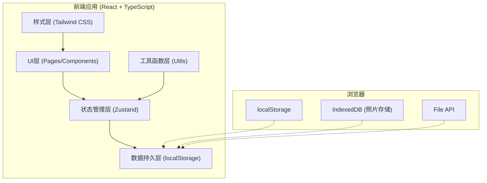
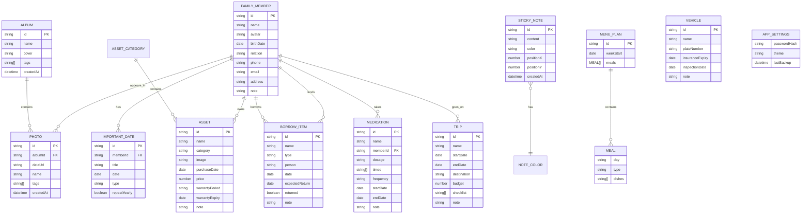

## 1. 架构设计



## 2. 技术描述

- **前端框架**：React 18 + TypeScript
- **构建工具**：Vite
- **样式方案**：Tailwind CSS 3
- **状态管理**：Zustand
- **路由管理**：React Router DOM
- **图标库**：Lucide React
- **数据存储**：localStorage（主要数据）+ IndexedDB（照片存储）
- **后端**：无（纯前端应用）
- **数据库**：无（浏览器本地存储）

## 3. 路由定义

| 路由 | 页面 | 功能 |
|------|------|------|
| `/` | 仪表盘 | 数据概览、今日提醒、快捷入口 |
| `/family` | 家庭树 | 成员档案、关系图、重要日期 |
| `/album` | 相册 | 照片管理、标签、拖拽上传 |
| `/assets` | 资产 | 家电、车辆、资产清单、借还 |
| `/schedule` | 日程 | 旅行、用药提醒、周菜单 |
| `/memo` | 备忘 | 便签墙、搜索、通讯录 |
| `/settings` | 导入导出 | 密码锁、数据导入导出 |

## 4. 数据模型

### 4.1 数据模型定义



### 4.2 数据持久化方案

所有数据通过 Zustand store 管理，并自动持久化到 localStorage：
- 文本类数据直接存储在 localStorage
- 照片数据使用 base64 存储在 localStorage（或 IndexedDB 优化）
- 导入导出功能打包所有数据为 JSON 文件

## 5. 项目结构

```
src/
├── components/          # 通用组件
│   ├── Layout/         # 布局组件
│   ├── Card/           # 卡片组件
│   ├── Modal/          # 模态框
│   ├── Button/         # 按钮组件
│   └── Empty/          # 空状态
├── pages/              # 页面组件
│   ├── Dashboard/      # 仪表盘
│   ├── Family/         # 家庭树
│   ├── Album/          # 相册
│   ├── Assets/         # 资产
│   ├── Schedule/       # 日程
│   ├── Memo/           # 备忘
│   └── Settings/       # 导入导出
├── store/              # 状态管理
│   ├── useFamilyStore.ts
│   ├── useAlbumStore.ts
│   ├── useAssetsStore.ts
│   ├── useScheduleStore.ts
│   ├── useMemoStore.ts
│   └── useSettingsStore.ts
├── utils/              # 工具函数
│   ├── storage.ts      # 本地存储
│   ├── date.ts         # 日期处理
│   ├── search.ts       # 全文搜索
│   └── export.ts       # 导入导出
├── types/              # 类型定义
│   └── index.ts
├── App.tsx
├── main.tsx
└── index.css
```

## 6. 核心技术方案

### 6.1 本地密码锁
- 使用 SHA-256 哈希存储密码
- 会话状态存储在 sessionStorage
- 支持修改密码
- 忘记密码需清空数据重新开始

### 6.2 照片存储
- 使用 FileReader 将图片转为 base64
- 压缩图片质量以节省存储空间
- 支持拖拽上传
- 数据导出时包含所有照片

### 6.3 全文搜索
- 遍历所有数据模块
- 匹配标题、内容、标签等字段
- 高亮显示匹配关键词
- 支持分类筛选

### 6.4 数据导入导出
- 导出：打包所有数据为 JSON 文件下载
- 导入：上传 JSON 文件恢复数据
- 支持导出前密码验证
- 导入前数据备份提示

### 6.5 家庭树可视化
- 使用纯 CSS + HTML 实现树形结构
- 展示夫妻关系和亲子关系
- 节点可点击查看详情
- 支持缩放和拖拽

### 6.6 便签墙拖拽
- 实现拖拽定位功能
- 不同颜色便签分类
- 自动保存位置
